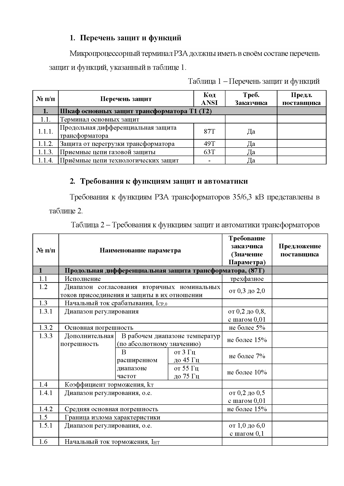
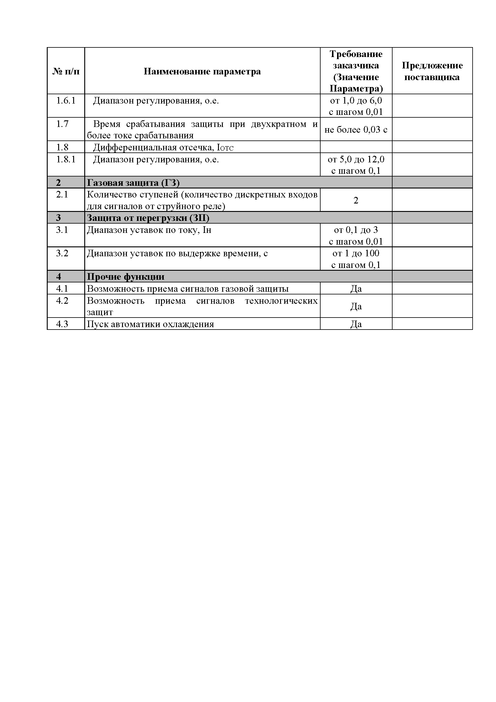

# Пример спецификации требований для промышленного контроллера

### Контекст:
В качестве иллюстрации проделанного объема работы, приведена спецификация требований к промышленному контроллеру, выполняющему функции защит силового оборудования.

В целях сохранения коммерческой тайны, требования приводятся в крайне урезанном виде, а также без наименования объекта применения и конечного Заказчика.

