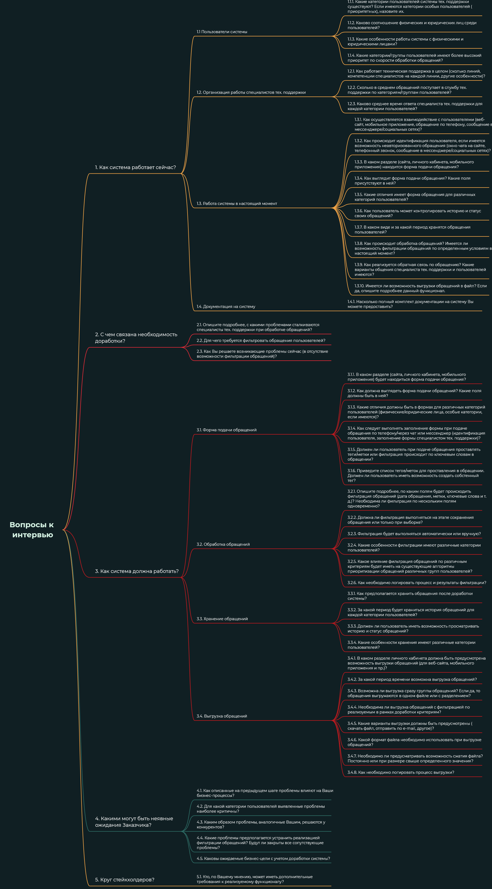

# Задание по теме "Методы сбора требований"

### Задание:

Вы работаете над развитием системы технической поддержки крупного интернет-провайдера, который предоставляет интернет физическим лицам и организациям.
В тех. поддержке работает 50 сотрудников. Их задача – фиксировать обращения клиентов, разбираться в проблемах и предлагать решения.

Описание потребности от Заказчика:

Руководитель подразделения поддержки назначил вам встречу для обсуждения доработки системы: сотрудникам не хватает возможности фильтровать записи о поступивших обращениях по различным критериям.
Так же необходимо реализовать возможность выгрузки обращений в файл.

### Цель:

Составить список вопросов так, чтобы выяснить максимум деталей о потребностях Заказчика.

---

