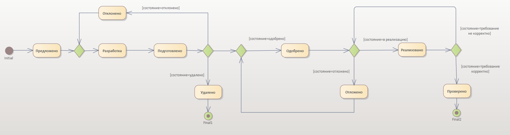

# Задание по теме "Согласование и управление изменениями требований"

### Задание:

Составить описание бизнес-процесса (можно использовать любую известную подходящую нотацию: диаграмма активити или диаграмма состояний UML, бизнес схема, BPMN).

Путь согласования требования: от момента его инициации до завершения работы с требованием.

Бизнес-процесс должен описать процесс перехода из одного состояния требования в другое.

---

